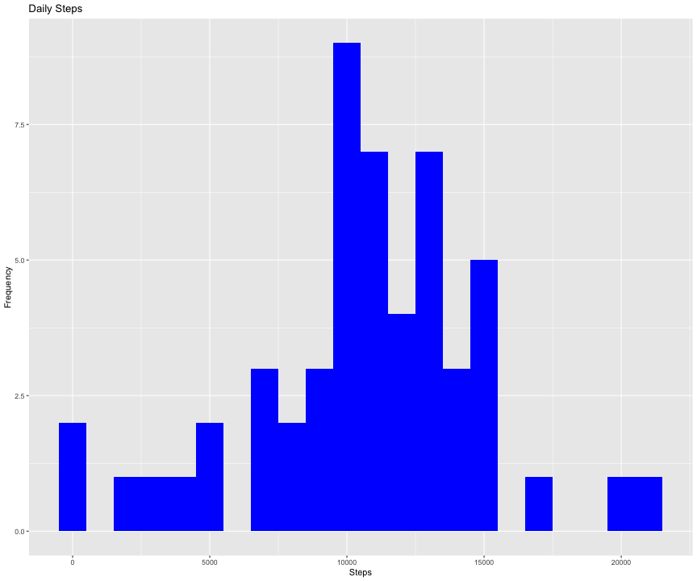
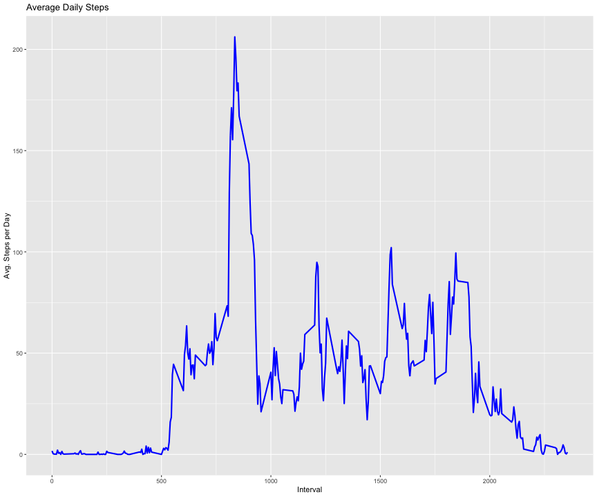
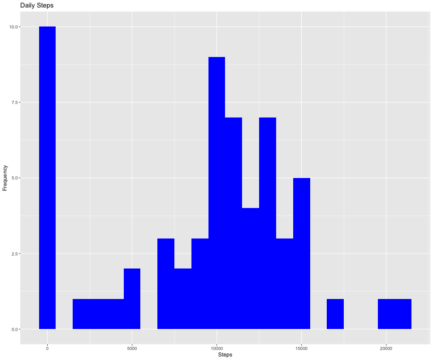
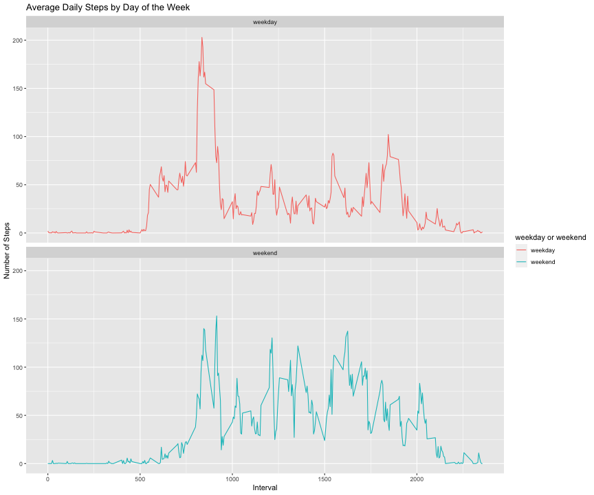

# Reproducible Research - Project 1

## Introduction

This assignment makes use of data from a personal activity monitoring device. This device collects data at 5 minute intervals through out the day. The data consists of two months of data from an anonymous individual collected during the months of October and November, 2012 and include the number of steps taken in 5 minute intervals each day.

The data for this assignment can be downloaded from the course web site:

* Dataset: Activity monitoring data (https://d396qusza40orc.cloudfront.net/repdata%2Fdata%2Factivity.zip)
The variables included in this dataset are:

*steps: Number of steps taking in a 5-minute interval (missing values are coded as NA)

*date: The date on which the measurement was taken in YYYY-MM-DD format

*interval: Identifier for the 5-minute interval in which measurement was taken

The dataset is stored in a comma-separated-value (CSV) file and there are a total of 17,568 observations in this dataset.

## Setting global options
To ensure that the echo = TRUE so that reviewer will be able to read the code

Added fixed width and height to the plots for consistency

```r
library(knitr)
opts_chunk$set(echo = TRUE, fig.width = 12, fig.height = 10)
```

## Loading and preprocessing the data
Download and unzip the data

```r
library("data.table")
library(ggplot2)

dataURL <- "https://d396qusza40orc.cloudfront.net/repdata%2Fdata%2Factivity.zip"
download.file(dataURL, destfile = paste0(getwd(), '/repdata%2Fdata%2Factivity.zip')
              , method = "curl")
unzip("repdata%2Fdata%2Factivity.zip", exdir = "data")
```

## Reading CSV data

```r
Data_activity <- data.table::fread(input = "data/activity.csv")

summary(Data_activity)
```

```
##      steps             date               interval     
##  Min.   :  0.00   Min.   :2012-10-01   Min.   :   0.0  
##  1st Qu.:  0.00   1st Qu.:2012-10-16   1st Qu.: 588.8  
##  Median :  0.00   Median :2012-10-31   Median :1177.5  
##  Mean   : 37.38   Mean   :2012-10-31   Mean   :1177.5  
##  3rd Qu.: 12.00   3rd Qu.:2012-11-15   3rd Qu.:1766.2  
##  Max.   :806.00   Max.   :2012-11-30   Max.   :2355.0  
##  NA's   :2304
```

## Calculating and plotting the total number of steps per day
Ignoring the missing values in dataset
Calculating the total number of steps per day

```r
Total_steps <- Data_activity[, c(lapply(.SD, sum, na.rm = FALSE))
                             , .SDcols = c("steps"), by = .(date)]
head(Total_steps, 5)
```

```
##          date steps
## 1: 2012-10-01    NA
## 2: 2012-10-02   126
## 3: 2012-10-03 11352
## 4: 2012-10-04 12116
## 5: 2012-10-05 13294
```

Plotting histogram of total number of steps per day

```r
ggplot(Total_steps, aes(x = steps)) + 
        geom_histogram(fill = "blue", binwidth = 1000) + 
        labs(title = "Daily Steps", x = "Steps", y = "Frequency")
```

```
## Warning: Removed 8 rows containing non-finite values (stat_bin).
```



Now, calculate and report the mean and median of the total number of steps per 
day

```r
Mean_steps <- Total_steps[, .(mean(steps, na.rm = TRUE))]
               
Median_steps <- Total_steps[, .(median(steps, na.rm = TRUE))]
```

## What is the daily activity pattern?

Make a time series plot (i.e. type = "l") of the 5-minute interval (x-axis) and 
the average number of steps taken, averaged across all days (y-axis)

```r
Data_Interval <- Data_activity[, c(lapply(.SD, mean, na.rm = TRUE)),
                               .SDcols = c("steps"), by = .(interval)]

ggplot(Data_Interval, aes(x = interval, y = steps)) +
               geom_line(color = "blue", size = 1) +
               labs(title = "Average Daily Steps", x = "Interval", 
                    y = "Avg. Steps per Day")
```



Which 5-minute interval, on average across all the days in the dataset, 
contains the maximum number of steps?

```r
Data_Interval[steps == max(steps), .(max_Interval = interval)]
```

```
##    max_Interval
## 1:          835
```

## Imputing missing values

Calculate and report the total number of missing values in the dataset 
(i.e. the total number of rows with NAs)


```r
nrow(Data_activity[is.na(steps), ])
```

```
## [1] 2304
```

Devise a strategy for filling in all of the missing values in the dataset. 
The strategy does not need to be sophisticated. For example, you could use 
the mean/median for that day, or the mean for that 5-minute interval, etc.


```r
Data_activity[is.na(steps), "steps"] <- Data_activity[, c(lapply(.SD, median, 
                                                                 na.rm = TRUE)),
                                                      .SDcols = c("steps")]
```

Create a new dataset that is equal to the original dataset but with the missing 
data filled in.


```r
data.table::fwrite(x = Data_activity, file = "data/Data_activity_woNA.csv",
                   quote = FALSE)
```

Make a histogram of the total number of steps taken each day and Calculate and 
report the mean and median total number of steps taken per day. Do these values 
differ from the estimates from the first part of the assignment? What is the 
impact of imputing missing data on the estimates of the total daily number of 
steps?

Plotting number of steps per day


```r
Total_steps <- Data_activity[, c(lapply(.SD, sum)), .SDcols = "steps", 
                             by = .(date)]

ggplot(Total_steps, aes(x = steps)) + 
        geom_histogram(fill = "blue", binwidth = 1000) + 
        labs(title = "Daily Steps", x = "Steps", y = "Frequency")
```



Now, calculate and report the mean and median of the total number of steps per 
day

```r
Mean_steps_woNA <- Total_steps[, .(mean(steps))]
               
Median_steps_woNA <- Total_steps[, .(median(steps))]
```

Following are the mean and median total number of steps per day with first data
(NA in data) and second data (replaced NA with median data)

* Mean of the total number of steps per day = First data (1.0766189 &times; 10<sup>4</sup>) Vs. Second Data (9354.2295082)

* Median of the total number of steps per day = First data (10765) Vs. Second Data (10395)

The mean and median estimates of the total daily number of steps were slightly 
reduced by imputing missing data.

## Are there differences in activity patterns between weekdays and weekends?

Create a new factor variable in the dataset with two levels -- "weekday" and 
"weekend" indicating whether a given date is a weekday or weekend day.


```r
Data_activity[, date := as.POSIXct(date, format = "%Y-%m-%d")]
Data_activity[, `Day of Week` := weekdays(x = date)]
Data_activity[grepl(pattern = "Monday|Tuesday|Wednesday|Thursday|Friday",
              x = `Day of Week`), "weekday or weekend"] <- "weekday"
Data_activity[grepl(pattern = "Saturday|Sunday", x = `Day of Week`),
              "weekday or weekend"] <- "weekend"
Data_activity[, `weekday or weekend` := as.factor(`weekday or weekend`)]
head(Data_activity, 5)
```

```
##    steps       date interval Day of Week weekday or weekend
## 1:     0 2012-10-01        0      Monday            weekday
## 2:     0 2012-10-01        5      Monday            weekday
## 3:     0 2012-10-01       10      Monday            weekday
## 4:     0 2012-10-01       15      Monday            weekday
## 5:     0 2012-10-01       20      Monday            weekday
```

Make a panel plot containing a time series plot (i.e. type = "l") of the 
5-minute interval (x-axis) and the average number of steps taken, averaged across
all weekday days or weekend days (y-axis). The plot should look something like 
the following, which was created using simulated data:


```r
Data_activity[is.na(steps), "steps"] <- Data_activity[, c(lapply(.SD, median, 
                                                                 na.rm = TRUE)),
                                                      .SDcols = c("steps")]

Data_Interval <- Data_activity[, c(lapply(.SD, mean, na.rm = TRUE)),
                                          .SDcols = c("steps"), 
                               by = .(interval, `weekday or weekend`)]

ggplot(Data_Interval, aes(x = interval, y = steps, color = `weekday or weekend`)) +
        geom_line() + labs(title = "Average Daily Steps by Day of the Week", 
                           x = "Interval", y = "Number of Steps") +
        facet_wrap(~`weekday or weekend`, ncol = 1, nrow = 2)
```


